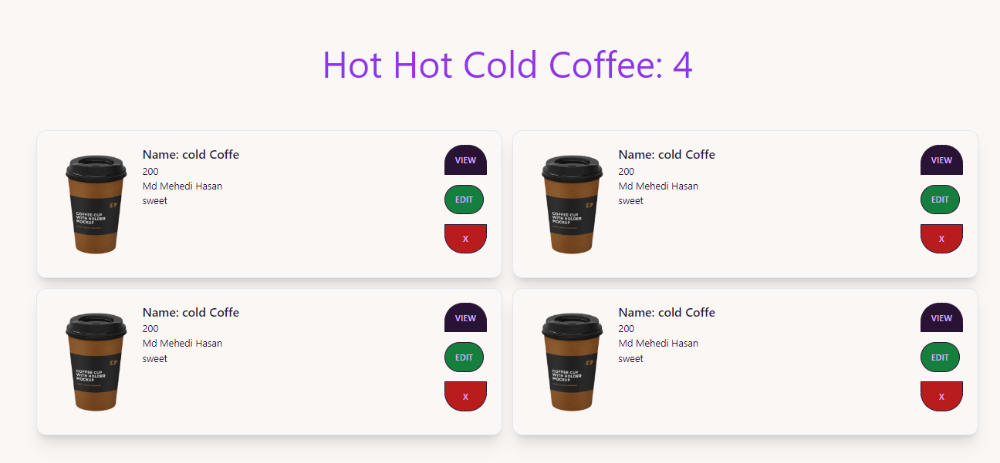
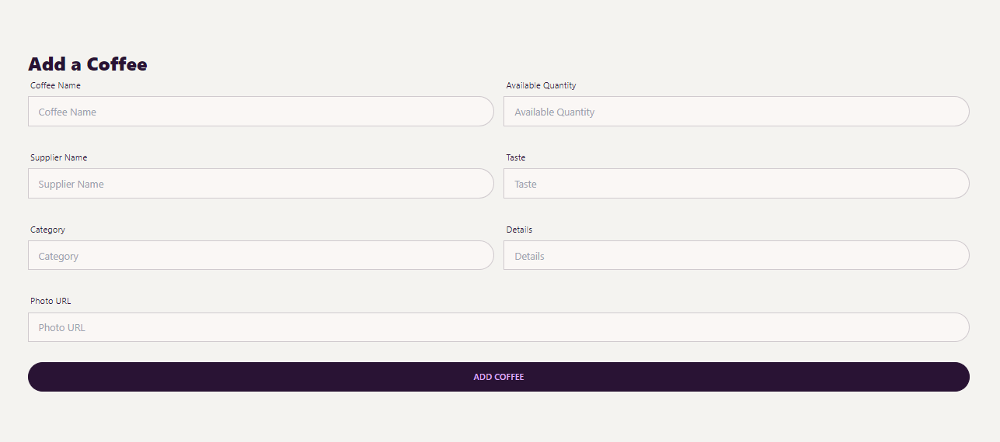
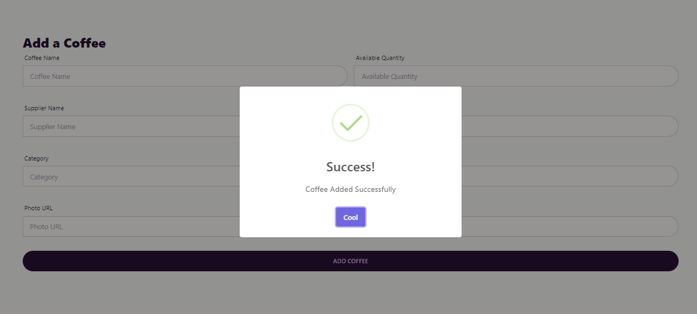
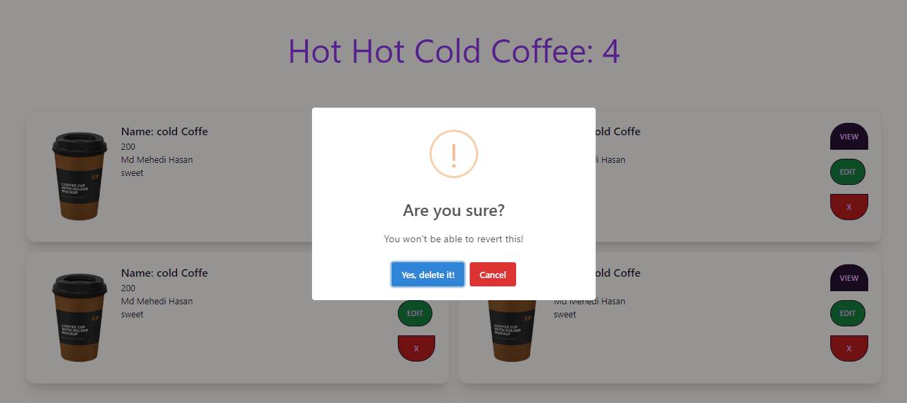

 <h1 align="center">CRUD Operation </h1>

<h3> -Features</h3>
<ul>
      <li>Add Coffee</li>
      <li>Update Coffee</li>
      <li>Delete Coffee</li>
</ul>
<h4 >  Frontend - HTML | TailwindCSS | React Js </h4>
<h4 > Backend - Json | Express Js | MongoDB </h4>   
 
<h1> DashBoard </h1>

<h1> Add Coffee </h1>

<h1> Success Toast </h1>

<h1> Delete Toast </h1>

<h5>Thank You! <h5>